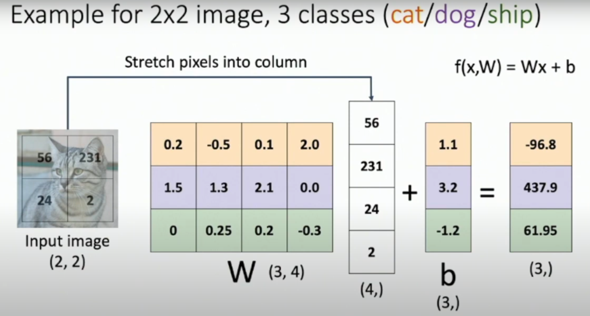

# **EECS-498-007-598-005**
Deep Learning for Computer Vision -  Fall 2020

## Notes
- A1 : KNN
- A2 : linear classifier, two layer network
    - ### SVM
        

        
        

        
        - The matrix dW represents the gradient (derivative) of the loss with respect to the weight matrix W.
        - $$loss_i = \frac{1}{N}\max(0, \text{scores}[j]_{j \neq y[i]} - \text{scores}[y[i]])$$
        for each wrong score of the class that contribute to the loss, the score of the correct class is all subtracted, so dw need to subtract x[i] everytime fingding a wrong score
    - ### Softmax
        - normalize the scores of each class, turning it into probabilities
        - $$P(y = j \mid \mathbf{x}) = \frac{e^{s_j}}{\sum_{k=1}^C e^{s_k}}$$
          $$L = \frac{1}{N}L_i = \frac{1}{N} \sum_{i=1}^N -\log(P(Y = y_i \mid x_i))$$
        - in the code:
        $$\log\left(\frac{e^{s_j}}{\sum_{k=1}^C e^{s_k}}\right) = s_j - \log\left(\sum_{k=1}^C e^{s_k}\right)$$
        $$\frac{\partial L}{\partial W[:,j]} = X[i] \times (prob_j - true\_label_j)$$
    - ReLU() why has to prevent the linear part with ReLU
    - ### Backpropagation
        - Getting the gradient
        - Getting higher-order derivative 
- Convolutional Network
    - VGG: stack 3*3 for the receptive field, half the spacial size and double the channels
